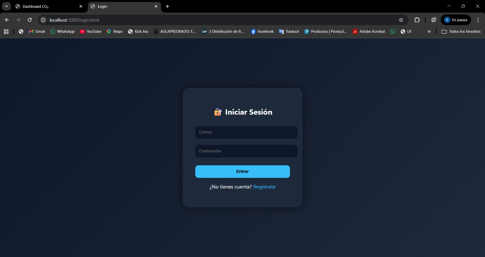
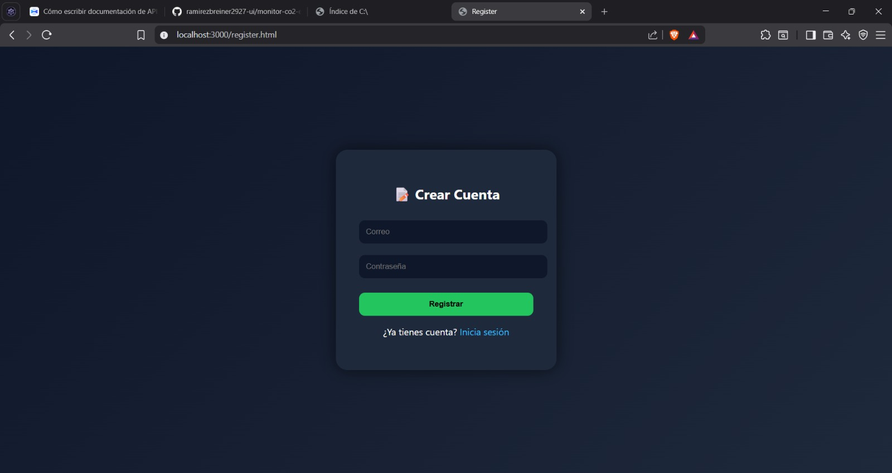
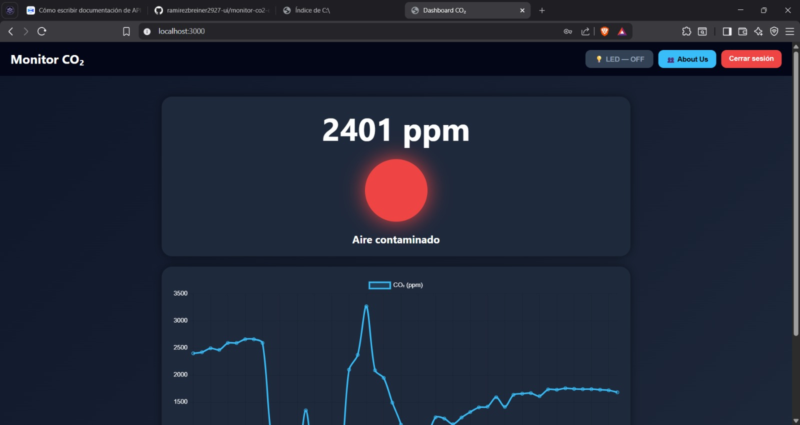
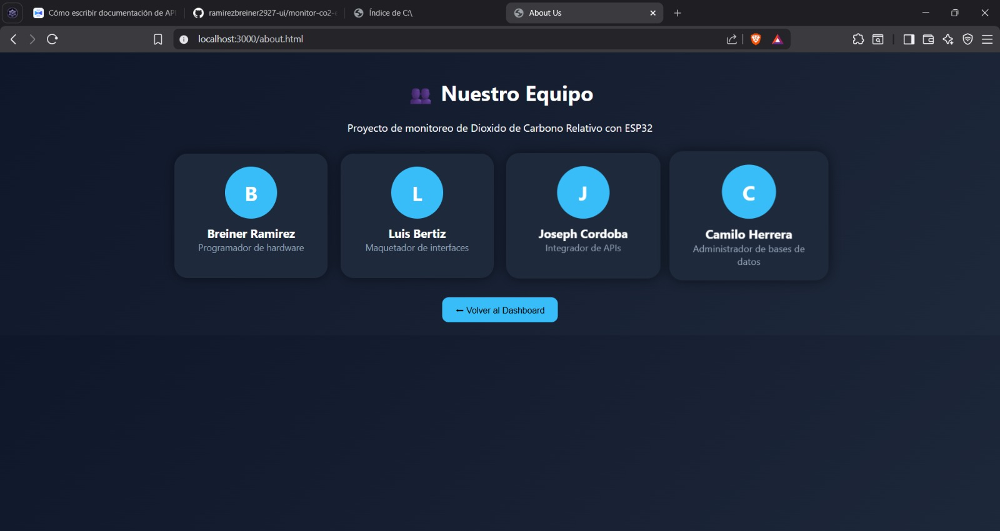

# 🌿 Monitor CO₂ con ESP32

## 📖 Introducción

El presente proyecto consiste en el desarrollo de un sistema de monitoreo de dióxido de carbono (CO₂) en tiempo real utilizando un sensor MQ135 y un microcontrolador ESP32. La solución implementada integra tecnologías de Internet de las Cosas (IoT) para capturar, procesar y visualizar datos ambientales mediante un tablero web interactivo accesible para los usuarios.

Además del monitoreo ambiental, el sistema incorpora funcionalidades de control remoto del LED integrado del ESP32, permitiendo la interacción en tiempo real entre la plataforma web y el dispositivo físico. El proyecto fue desarrollado con el propósito de aplicar conocimientos de programación, electrónica y desarrollo web, demostrando la integración eficiente entre hardware y software en sistemas inteligentes conectados.

---

# 🎯 Objetivos del Proyecto

## 🎯 Objetivo General

Desarrollar un sistema IoT de monitoreo de dióxido de carbono (CO₂) en tiempo real utilizando un sensor MQ135 y un ESP32, integrando una plataforma web interactiva para la visualización de datos y el control remoto del dispositivo.

## ✅ Objetivos Específicos

- Implementar la lectura de datos ambientales mediante el sensor MQ135 conectado al ESP32.
- Diseñar un tablero web para visualizar la información del monitoreo en tiempo real.
- Desarrollar un sistema de autenticación de usuarios mediante módulos de login y registro.
- Integrar el control remoto del LED del ESP32 desde la plataforma web.
- Aplicar conceptos de Internet de las Cosas (IoT), programación embebida y desarrollo web en una solución funcional e interactiva.
- Mejorar la experiencia del usuario mediante una interfaz intuitiva y de fácil acceso.

## 📄 Objetivo de Documentación

- Elaborar una documentación técnica clara y estructurada que facilite la comprensión, instalación, funcionamiento y mantenimiento del sistema de monitoreo de CO₂ desarrollado.

---

# 👥 Equipo de Trabajo

| Nombre | Rol |
|---|---|
| Breiner Ramirez | Programador de hardware |
| Luis Bertiz | Maquetador de interfaces |
| Joseph Cordoba | Integrador de APIs |
| Camilo Herrera | Administrador de bases de datos |

---

# 🛠️ Tecnologías Utilizadas

- **Hardware:** ESP32 + Sensor MQ135
- **Backend:** Node.js + Express + MongoDB
- **Frontend:** HTML, CSS, JavaScript, Chart.js
- **Autenticación:** JWT + bcrypt

---

# 📁 Estructura del Proyecto

```bash
api-esp32/
├── public/
│   ├── index.html       # Dashboard principal
│   ├── login.html       # Inicio de sesión
│   ├── register.html    # Registro de usuario
│   └── about.html       # Información del equipo
├── images/
│   ├── login.jpeg
│   ├── register.jpeg
│   ├── dashboard.jpeg
│   └── about us.jpeg
├── index.js             # API REST (servidor Node.js)
├── Co2file.ino          # Código del ESP32
├── .env.example         # Variables de entorno
├── .gitignore
└── README.md
```

---

# 🌐 Sitio Web

La plataforma web fue desarrollada con el propósito de permitir la interacción entre los usuarios y el sistema de monitoreo de CO₂ implementado con ESP32. A través de una interfaz intuitiva y dinámica, el sitio web permite visualizar información en tiempo real, gestionar usuarios y controlar funcionalidades del dispositivo de manera remota.

---

# 🔐 Login

El módulo de inicio de sesión fue implementado para permitir el acceso seguro de los usuarios registrados a la plataforma web. Esta funcionalidad garantiza que únicamente usuarios autenticados puedan acceder al dashboard y a las herramientas de control del sistema.

Además, el diseño de la interfaz fue realizado buscando simplicidad y facilidad de uso, proporcionando una experiencia intuitiva para el usuario final.

## 📌 Funcionalidades principales

- Validación de credenciales.
- Acceso seguro al sistema.
- Redirección automática al dashboard.
- Interfaz amigable y responsiva.

## 💻 Fragmento de código

```html
<form class="login-form">
  <input type="email" placeholder="Correo electrónico">
  <input type="password" placeholder="Contraseña">
  <button type="submit">Iniciar sesión</button>
</form>
```

## 🖼️ Vista Login



---

# 📝 Register / Sign Up

El módulo de registro permite la creación de nuevas cuentas de usuario dentro de la plataforma. Esta funcionalidad facilita el acceso personalizado al sistema y mejora la gestión de usuarios.

El formulario fue diseñado para recopilar información básica y permitir un proceso de registro rápido y sencillo.

## 📌 Funcionalidades principales

- Registro de nuevos usuarios.
- Validación de campos.
- Creación de cuentas personalizadas.
- Interfaz clara y organizada.

## 💻 Fragmento de código

```html
<form class="signup-form">
  <input type="text" placeholder="Nombre">
  <input type="email" placeholder="Correo">
  <input type="password" placeholder="Contraseña">
  <button type="submit">Registrarse</button>
</form>
```

## 🖼️ Vista Register



---

# 📊 Dashboard

El dashboard permite visualizar en tiempo real los niveles de CO₂ obtenidos desde el sensor MQ135 conectado al ESP32. La interfaz muestra gráficos dinámicos y controles interactivos para supervisar el estado del sistema y controlar el LED del dispositivo.

El sistema fue desarrollado utilizando Chart.js para representar visualmente los datos obtenidos desde el sensor, permitiendo una mejor interpretación de la calidad del aire.

## 📌 Funcionalidades principales

- Visualización de datos en tiempo real.
- Gráficas dinámicas con Chart.js.
- Monitoreo del estado del LED.
- Control remoto del LED integrado del ESP32.
- Diseño moderno y responsivo.

## 💻 Fragmento de código

```javascript
const chart = new Chart(ctx, {
  type: 'line',
  data: {
    labels: labels,
    datasets: [{
      label: 'Nivel de CO₂',
      data: dataValues
    }]
  }
});
```

## 🖼️ Vista Dashboard



---

# 👥 About Us

La sección **About Us** fue desarrollada con el objetivo de presentar información general sobre el equipo encargado del desarrollo del sistema de monitoreo de CO₂. Esta página permite identificar a los integrantes del proyecto, sus roles y las tecnologías utilizadas durante la implementación de la solución IoT.

Además de brindar información del equipo, esta sección ayuda a ofrecer una visión más profesional y organizada del proyecto, mostrando la colaboración entre las diferentes áreas de desarrollo como hardware, backend, frontend y bases de datos.

## 📌 Funcionalidades principales

- Presentación del equipo de desarrollo.
- Visualización de roles y responsabilidades.
- Diseño moderno y organizado.
- Integración visual con el resto de la plataforma.
- Interfaz responsiva y fácil de navegar.

## 💻 Fragmento de código

```html
<section class="about-container">
  <h1>Sobre Nosotros</h1>

  <div class="team-card">
    <h2>Breiner Ramirez</h2>
    <p>Programador de hardware</p>
  </div>

  <div class="team-card">
    <h2>Luis Bertiz</h2>
    <p>Maquetador de interfaces</p>
  </div>

  <div class="team-card">
    <h2>Joseph Cordoba</h2>
    <p>Integrador de APIs</p>
  </div>

  <div class="team-card">
    <h2>Camilo Herrera</h2>
    <p>Administrador de bases de datos</p>
  </div>
</section>
```

## 🖼️ Vista About Us

)

---

# ⚙️ Instalación

## 1️⃣ Clonar el repositorio

```bash
git clone https://github.com/TU_USUARIO/monitor-co2-esp32.git
cd monitor-co2-esp32
```

## 2️⃣ Instalar dependencias

```bash
npm install
```

## 3️⃣ Configurar variables de entorno

```bash
cp .env.example .env
```

Edita el archivo `.env` con tus valores personalizados.

## 4️⃣ Iniciar el servidor

```bash
node index.js
```

## 5️⃣ Configurar el ESP32

Abre `Co2file.ino` en Arduino IDE y actualiza las siguientes variables:

```cpp
const char* ssid = "TU_WIFI";
const char* password = "TU_PASSWORD";

const char* serverSensor = "http://IP_DE_TU_PC:3000/sensor";
const char* serverLed    = "http://IP_DE_TU_PC:3000/led/estado";
```

---

# 🔌 Hardware Utilizado

| Componente | Pin ESP32 |
|---|---|
| Sensor MQ135 (AOUT) | GPIO 34 |
| LED integrado azul | GPIO 2 |

---

# 🚦 Niveles de CO₂

| Nivel | Estado |
|---|---|
| < 800 ppm | ✅ Aire limpio |
| 800 - 1200 ppm | ⚠️ Calidad moderada |
| > 1200 ppm | 🚨 Aire contaminado |

---

# 📡 Endpoints de la API

| Método | Ruta | Descripción | Auth |
|---|---|---|---|
| POST | /register | Registrar usuario | No |
| POST | /login | Iniciar sesión | No |
| POST | /sensor | Recibir dato del ESP32 | No |
| GET | /datos | Obtener últimos 50 registros | Sí |
| POST | /led/on | Encender LED | Sí |
| POST | /led/off | Apagar LED | Sí |
| GET | /led/estado | Estado actual del LED | No |

---

# ✅ Conclusiones

El desarrollo de este proyecto permitió implementar un sistema funcional de monitoreo de dióxido de carbono (CO₂) en tiempo real mediante el uso del sensor MQ135 y el microcontrolador ESP32, integrando conceptos de Internet de las Cosas (IoT), programación embebida y desarrollo web.

Asimismo, la creación de una plataforma web con módulos de login, registro, dashboard y control remoto del LED permitió fortalecer la interacción entre el usuario y el dispositivo físico, ofreciendo una experiencia más dinámica e intuitiva.

La integración de tecnologías como HTML, CSS, JavaScript, Node.js y ESP32 evidenció la capacidad de desarrollar soluciones tecnológicas conectadas, capaces de combinar hardware y software en un entorno práctico y funcional.
---

# 🧪 Documentación de API

La API REST del proyecto fue documentada utilizando **ApiDog**, permitiendo visualizar y probar fácilmente cada uno de los endpoints disponibles del sistema de monitoreo de CO₂.

A través de esta documentación es posible consultar rutas, métodos HTTP, parámetros y respuestas del servidor de manera interactiva.

## 🔗 Acceso a la documentación

👉 [Ver documentación de la API](https://orns67fxuv.apidog.io)

## 📌 Funcionalidades disponibles

- Pruebas de endpoints en tiempo real.
- Visualización de solicitudes y respuestas.
- Documentación organizada de la API REST.
- Soporte para autenticación y pruebas HTTP.
- Acceso rápido para desarrolladores e integradores.


